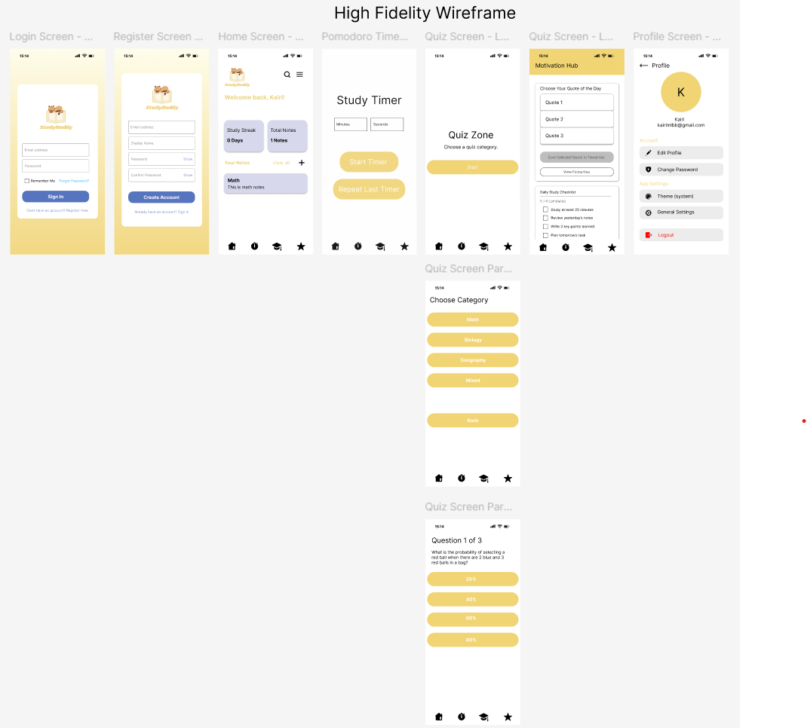
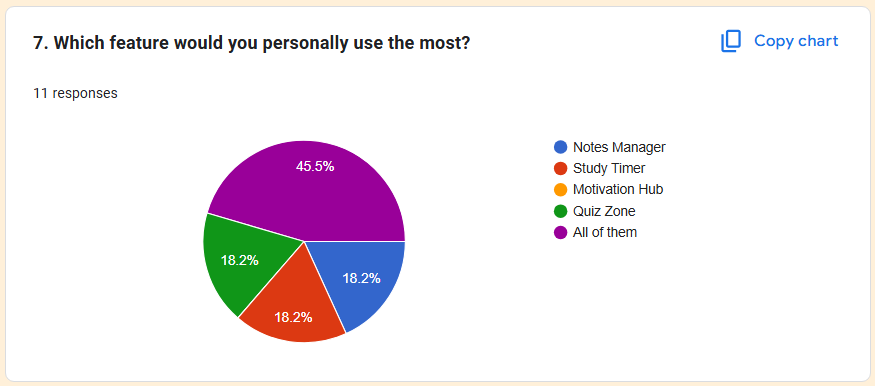
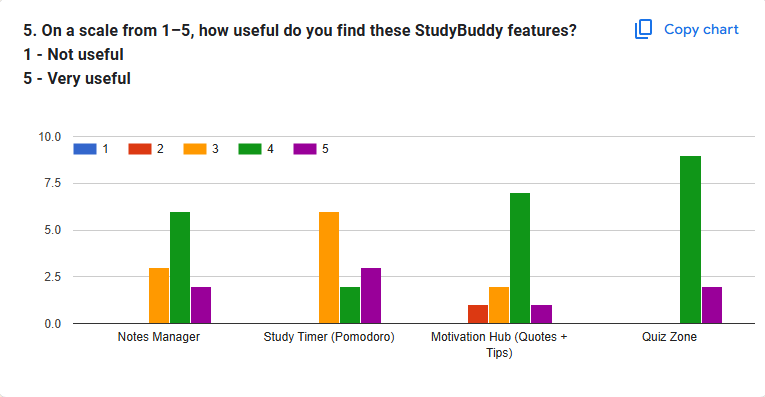
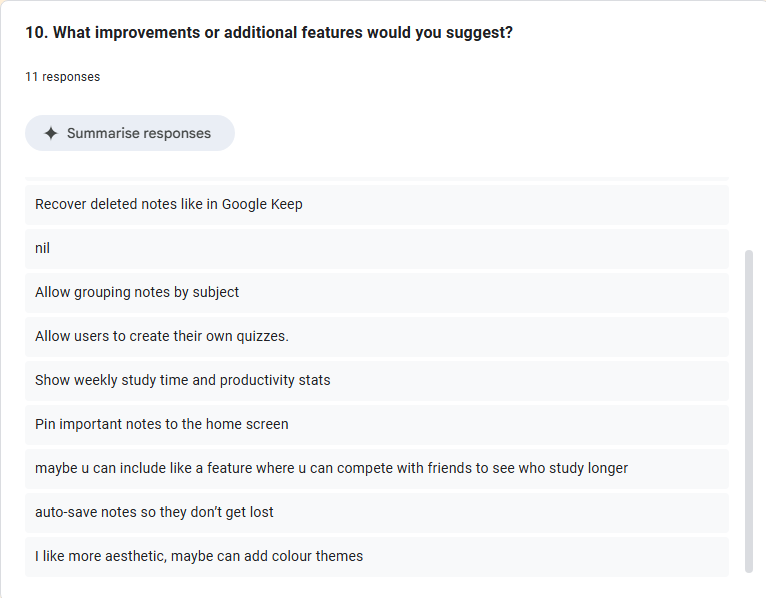
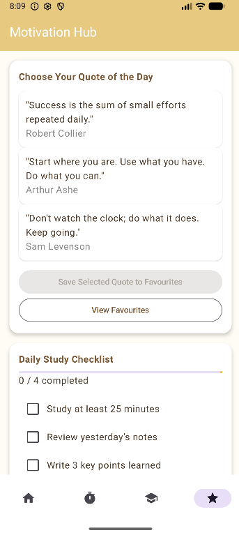
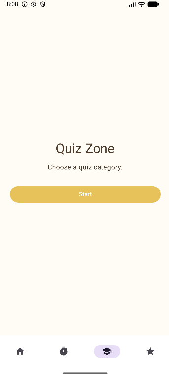

# MAD25_T01_Team3  
# StudyBuddy – Student Productivity & Learning Companion

## Table of Contents

1. [Introduction](#introduction)
2. [App Category](#app-category)
3. [Motivation & Objectives](#motivation--objectives)
4. [Design Considerations](#design-considerations)
5. [Feature Overview](#feature-overview)
6. [User Guide](#user-guide)
7. [Stage 1 Feature Responsibilities](#stage-1-feature-responsibilities)
8. [Competitor Analysis](#competitor-analysis)
9. [Planned Stage 2 Features](#planned-stage-2-features)
10. [LLM Usage Declaration](#llm-usage-declaration)
11. [Team Members](#team-members)
12. [Appendices](#appendices)
13. [Disclaimer](#disclaimer)

---

## Introduction

**StudyBuddy** is an educational productivity mobile application designed to help students organize their study life, stay focused, and remain motivated.  
By integrating note-taking, focus timers, quizzes, and motivational content, StudyBuddy acts as an all-in-one personal study assistant.

The app is suitable for:

- Primary School  
- Secondary School  
- JC / Poly / ITE  
- University students  
- Working adults seeking productive learning habits  

---

## App Category

StudyBuddy falls under the **Education** category, focusing on:

- Study Productivity  
- Time Management  
- Note Organization  
- Self-Learning Tools  
- Motivation & Study Discipline  

---

## Motivation & Objectives

Students often struggle with:

- Losing notes  
- Difficulty focusing  
- Lack of motivation  
- Poor time management  
- Inefficient revision habits  

### StudyBuddy aims to solve these by:

- Offering a centralized platform for studying  
- Encouraging productive routines using Pomodoro  
- Providing daily inspiration and study tips  
- Supporting self-assessment through quizzes  
- Allowing easy and structured note-taking  

The primary objective is to help students build **consistent, organized, and effective study habits**.

---

## Design Considerations

### 1. Student-Centric UI  
A clean interface that reduces cognitive load and improves navigation for younger and older students.

### 2. Modular Functions  
Each module (Notes, Timer, Motivation Hub, Quiz Zone) is independently built for scalability and clarity.

### 3. Offline-First Architecture  
Core features such as **Notes, Motivational quotes, and Quizzes** are now stored using Firebase Firestore, ensuring secure cloud backup and multi-device accessibility.
The **Pomodoro timer** will have its data stored offline in Share Preference.

### 4. Consistency & Familiarity  
Design inspiration taken from Notion, Quizlet, and Forest to maintain familiarity while offering unique features.

### 5. Expandability for Stage 2  
The current architecture is intentionally modular, allowing new features to be added without disrupting existing components. This enables future enhancements such as cloud synchronization, usage analytics, and notification-based reminders.

Cloud Sync: Centralizing user data in Firebase allows notes, quiz progress, motivation preferences, and timer history to be accessed across multiple devices. This improves reliability and prevents data loss.

Analytics & Insights: By tracking study duration, streaks, frequently used features, and quiz performance, the app can provide personalized recommendations to improve study habits.

Smart Notifications: Reminder systems can encourage users to return to the app, complete study sessions, or review saved notes, supporting long-term engagement and consistency.

Feature Scalability: Each module (Notes, Timer, Motivation Hub, Quiz Zone) is built as an independent component, making it easy to introduce new standalone features such as habit tracking, study streak achievements, or external API integrations without requiring major redesigns.

This forward-thinking structure ensures StudyBuddy can grow into a more intelligent, personalized, and supportive study ecosystem over time.

---

## Feature Overview

### **1. Login + Notes Manager** (By Zhi Xun)
This feature allows users to create an account, log in securely, and manage their study notes in an organized manner. Students can create, edit, delete, and categorize notes by subject or module.

Reason for implementation:
Students often struggle with scattered or misplaced notes. A centralized note-taking system ensures all study materials stay accessible, structured, and backed up across devices through Firebase authentication.

### **2. Motivation Hub** (By Zhizhong)
The Motivation Hub provides daily motivational quotes and study tips to help students build resilience and maintain consistent study habits. Users can save their favourite quotes for quick access, and background images help fulfil the multimedia requirement.

Reason for implementation:
Many students lose motivation easily, especially during stressful periods. Having a dedicated space that boosts morale helps reinforce positive study behaviour and makes the app more emotionally supportive — something most study apps overlook.

### **3. Study Timer (Pomodoro)** (By Arjun)
The Study Timer uses the Pomodoro technique, offering 25-minute focus sessions followed by short breaks. The timer includes simple animations and a clean UI to guide users through productive study cycles.

Reason for implementation:
Students often face difficulties maintaining focus. Pomodoro is a proven method for improving productivity and reducing burnout, making it a valuable feature for learners who need structure during their study sessions.

### **4. Quiz Zone** (By Daniel)
The Quiz Zone presents subject-based multiple-choice questions stored on Firebase, allowing students to practise and reinforce their understanding. It displays scores, correctness, and feedback for self-assessment.

Reason for implementation:
Self-testing is one of the most effective ways to strengthen long-term memory. This feature helps students identify knowledge gaps and revise more efficiently, making StudyBuddy not just a productivity tool but a genuine learning companion.

---

## User Guide

To setup and run the application in your local environment, please follow these steps:

### Prerequisites
* Android Studio Ladybug (or newer)
* Minimum SDK: API 24 (Android 7.0)
* Recommended Emulator: Pixel 8 API 35

### Installation & Running
1.  **Clone the Repository:**
    ```bash
    git clone https://github.com/whyjsjejwj/MAD25_T01_Team03.git
    ```
2.  **Open in Android Studio:**
    Select `File > Open` and navigate to the cloned folder.
3.  **Sync Gradle:**
    Allow Android Studio to download necessary dependencies.
4.  **Run the App:**
    Select an emulator or connected device and click the **Run** (Play) button.

---

## Stage 1 Feature Responsibilities

| Member | Feature | Description |
|--------|---------|-------------|
| **Pey Zhi Xun** | Login + Notes Manager | Authentication + notes CRUD and organization |
| **Fan Zhizhong** | Motivation Hub | Quotes, study tips, and favourite saving |
| **Arjun Vivekananthan** | Study Timer | Pomodoro timer and UI for focus sessions |
| **Daniel Sha** | Quiz Zone | Quiz interface, scoring logic, and question sets |

---

## Competitor Analysis
StudyBuddy operates in a competitive landscape of study tools, planners, and habit-building apps.  
To refine our value proposition, we analysed three key competitors: **StudySmarter**, **Classify**, and **Forest**.  

---

### **Competitor Overview**

#### **1. StudySmarter**
A popular learning platform offering student-generated flashcards, revision tools, and study analytics.

#### **2. Classify (Student Planner App)**
A lightweight planner for schedules and homework tracking, mainly targeted at secondary/tertiary students.

#### **3. Forest**
A gamified focus timer designed to reduce screen distraction and reinforce productive habits.

---

### **Feature Comparison Table**

| Feature / App        | **StudyBuddy** | StudySmarter | Classify | Forest |
|----------------------|----------------|--------------|----------|--------|
| Notes Manager        | Yes            | Limited      | No       | No     |
| Motivational Quotes  | Yes            | No           | No       | No     |
| Study Timer          | Yes            | No           | No       | Yes    |
| Study Tips / Habits  | Yes            | No           | No       | Limited |
| User Accounts        | Firebase       | Optional     | No       | No     |
| Cloud Sync           | KIV            | Not full     | No       | No     |
| Student Focus        | Very Strong    | Medium       | Strong   | Medium |
| Target Age Group     | All students   | Uni/JC       | Sec/Tertiary | All students |

StudyBuddy positions itself as an **all-in-one study companion with motivational elements**, unlike competitors that focus only on timers or planners.  

---

### **Competitor Strengths**

#### **StudySmarter**
- Huge flashcard library and student-generated content  
- Strong revision tools (quizzes, spaced repetition)  
- Progress analytics  
- Large active user population  

#### **Classify**
- Very simple UI suitable for younger students  
- Clean, minimal homework/timetable tracking  
- Very easy onboarding  

#### **Forest**
- Powerful gamification — tree-growing system  
- Excellent habit-building appeal  
- Strong psychological engagement  

---

### **Competitor Weaknesses**

#### **StudySmarter**
- Overcrowded UI with too many features  
- Contains ads that disrupt studying  
- Lacks motivational features  
- No integration of notes + motivation + study habits  

#### **Classify**
- Only covers timetable/homework  
- No notes, tips, or motivational features  
- No cloud sync  
- Not deep enough for tertiary students  

#### **Forest**
- Only a timer; not a study-specific tool  
- No notes, reminders, or study guides  
- Long-term engagement tends to drop once novelty fades  

---

### **Opportunities for StudyBuddy**

1. **Become the “Motivational Study Companion”** StudyBuddy uniquely blends notes, motivation, tips, and habits — no competitor provides this combination.

2. **Appeal to Primary & Secondary Students** Unlike competitors targeting older students, StudyBuddy’s friendly branding and mascot appeal to younger learners.

3. **All-in-one convenience** Students often use multiple apps (Notion, Forest, Pinterest, TikTok).  
   StudyBuddy reduces friction by consolidating productivity, notes, and motivation into one app.

4. **Cloud Safety via Firebase** Forest and Classify lack multi-device sync — a clear advantage for StudyBuddy.

5. **Potential for a “Study Habit Engine”** Features like streaks, scheduled tips, and motivational routines are not found in competitor apps.

---

### **Threats**

- Competitors may add similar features (e.g., Forest adding quotes, StudySmarter adding motivation)  
- Large platforms like Notion or Google Classroom may expand into habit/motivation features  
- Retention challenges if onboarding or motivation delivery becomes repetitive or cluttered  

---

### **StudyBuddy’s Unique Value Proposition (UVP)**

**StudyBuddy is a friendly, beginner-focused study companion that keeps students motivated, organised, and consistent** — combining **notes, study tips, habits, and motivation** in one seamless experience.

**What makes StudyBuddy stand out:**

- The **ONLY** app among competitors with a **Motivation Hub** - Appealing mascot + modern, soft aesthetic for younger learners  
- Lightweight and simple (less overwhelming than Notion/StudySmarter)  
- Integrated ecosystem: *Notes + Motivation + Habits* ---

## Planned Stage 2 Features

Each team member will implement one *stand-alone* feature requiring new concepts, such as a new Activity, background Service, or advanced API.

> **To be updated once finalized by the team.**

| Member | Planned Stage 2 Feature |
|--------|--------------------------|
| **Pey Zhi Xun** | Notes Category & Study Groups |
| **Fan Zhizhong** | Subscription Plans |
| **Arjun Vivekananthan** | *To be added* |
| **Daniel Sha** | Study Reflection Journal |

---

## LLM Usage Declaration

This project uses **ChatGPT** to assist with:

- Kotlin syntax clarification  
- Debugging and code review  
- Documentation writing  
- UI/UX layout suggestions  
- Learning Android concepts (Room, ViewModel, etc.)  

**All team members** (Zhizhong, Zhi Xun, Arjun, Daniel) used ChatGPT as a learning and support tool.  
All AI output was **reviewed, edited, and customized** before inclusion in code.

---

## Team Members

<table>
  <tr>
    <td align="center"><a href="https://github.com/whyjsjejwj"><br /><sub><b>Fan Zhizhong</b></sub></a></td>
    <td align="center"><a href="https://github.com/PeyZhiXun"><br /><sub><b>Pey Zhi Xun</b></sub></a></td>
    <td align="center"><a href="https://github.com/mk1342"><br /><sub><b>Arjun Vivekananthan</b></sub></a></td>
    <td align="center"><a href="https://github.com/Daniel-Sha14"><br /><sub><b>Daniel Sha</b></sub></a></td>
  </tr>
</table>

---

## Appendices

### 1. Wireframes

**Low-Fidelity Wireframes (Sketches)**<br />


<br />

**High-Fidelity Wireframes (Figma)**<br />


### 2. User Research (Survey Responses)

**Survey Data & Personas**<br />
<p float="left">
  
  
  
  
</p>

### 3. App Screenshots (Stage 1)

**Authentication & Notes**<br />
<p float="left">
  
   
</p>

<br />

**Motivation Hub**<br />
<p float="left">
  
</p>

<br />

**Study Timer (Pomodoro)**<br />
<p float="left">
  
</p>

<br />

**Quiz Zone**<br />
<p float="left">
  
</p>

---

## Disclaimer

This is a student assignment project for the **Mobile App Development (MAD)** module at **Ngee Ann Polytechnic**.  
This project is developed solely for **educational purposes**.