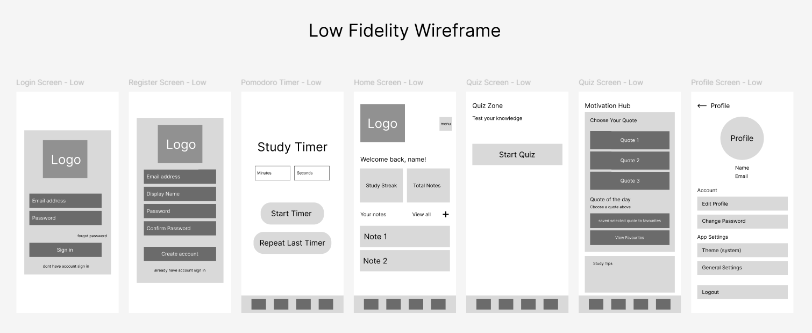
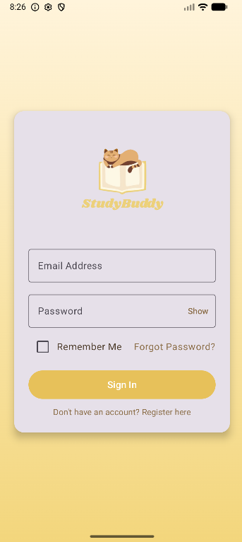
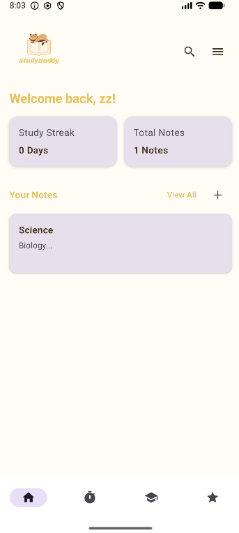
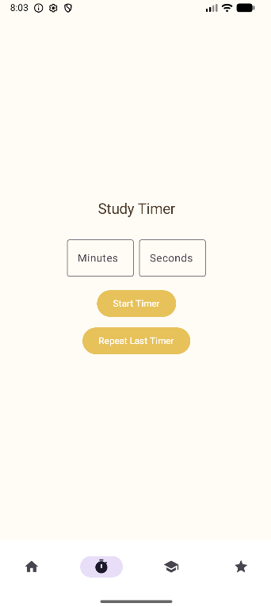

# MAD25_T01_Team3  
# StudyBuddy – Student Productivity & Learning Companion

## Table of Contents

1. [Introduction](#introduction)
2. [App Category](#app-category)
3. [Motivation & Objectives](#motivation--objectives)
4. [Design Considerations](#design-considerations)
5. [Feature Overview](#feature-overview)
6. [User Guide](#user-guide)
7. [Stage 1 Feature Responsibilities](#stage-1-feature-responsibilities)
8. [Competitor Analysis](#competitor-analysis)
9. [Planned Stage 2 Features](#planned-stage-2-features)
10. [LLM Usage Declaration](#llm-usage-declaration)
11. [Team Members](#team-members)
12. [Appendices](#appendices)
13. [Disclaimer](#disclaimer)

---

## Introduction

**StudyBuddy** is an educational productivity mobile application designed to help students organize their study life, stay focused, and remain motivated.  
By integrating note-taking, focus timers, quizzes, and motivational content, StudyBuddy acts as an all-in-one personal study assistant.

The app is suitable for:

- Primary School  
- Secondary School  
- JC / Poly / ITE  
- University students  
- Working adults seeking productive learning habits  

---

## App Category

StudyBuddy falls under the **Education** category, focusing on:

- Study Productivity  
- Time Management  
- Note Organization  
- Self-Learning Tools  
- Motivation & Study Discipline  

---

## Motivation & Objectives

Students often struggle with:

- Losing notes  
- Difficulty focusing  
- Lack of motivation  
- Poor time management  
- Inefficient revision habits  

### StudyBuddy aims to solve these by

- Offering a centralized platform for studying  
- Encouraging productive routines using Pomodoro  
- Providing daily inspiration and study tips  
- Supporting self-assessment through quizzes  
- Allowing easy and structured note-taking  

The primary objective is to help students build **consistent, organized, and effective study habits**.

---

## Design Considerations

### 1. Student-Centric UI
A clean interface that reduces cognitive load and improves navigation for younger and older students.

### 2. Modular Codebase
Each module (Notes, Timer, Motivation Hub, Quiz Zone) is independently built. This separation allowed different team members to work on complex features (like Media Players or Chat Systems) simultaneously without causing merge conflicts.

### 3. Expanded Cloud Ecosystem (Stage 2 Upgrade)
Building on the basic Firebase integration from Stage 1 (Auth & Static Data), Stage 2 introduces a **comprehensive real-time synchronization system**.
- **User-Centric Data Sync:** We moved from local-only storage for user generated content to **Firestore Cloud Sync**, allowing Notes, Habit Logs, and Mood Diaries to be accessible across multiple devices.
- **Real-Time Interactivity:** The architecture now supports live data listeners, enabling features like **instant messaging** in Study Groups and dynamic updates to the Subscription status.
- **Offline Reliability:** We utilized Firestore’s offline persistence to ensure students can still access and edit their work without internet, with changes automatically pushing to the cloud upon reconnection.

### 4. Background Processing & Services (Stage 2 Upgrade)
To create a seamless study experience, we implemented Android **Foreground Services**.
- **Continuous Operation:** Features like the **Lo-fi Media Player** can run independently of the main UI, ensuring study music isn't interrupted when the user navigates to other screens or locks their phone.
- **Resource Management:** The app manages system resources efficiently to prevent battery drain during long study sessions.

### 5. Engagement & Gamification Engine (Stage 2 Upgrade)
We shifted focus from simple utility tools to a system designed for **long-term retention**.
- **Behavioral Loop:** By integrating **Streaks, Mood Tracking, and Progression Tiers**, the app psychologically rewards consistent usage.
- **Data-Driven Insights:** The architecture now aggregates user activity (quizzes taken, habits checked) to provide meaningful analytics, transforming raw data into motivation.

---

## Feature Overview (Stage 1)

### **1. Login + Notes Manager** (By Zhi Xun)
This feature allows users to create an account, log in securely, and manage their study notes in an organized manner. Students can create, edit, delete, and categorize notes by subject or module.

Reason for implementation:
Students often struggle with scattered or misplaced notes. A centralized note-taking system ensures all study materials stay accessible, structured, and backed up across devices through Firebase authentication.

### **2. Motivation Hub** (By Zhizhong)
The Motivation Hub provides daily motivational quotes and study tips to help students build resilience and maintain consistent study habits. Users can save their favourite quotes for quick access, and background images help fulfil the multimedia requirement.

Reason for implementation:
Many students lose motivation easily, especially during stressful periods. Having a dedicated space that boosts morale helps reinforce positive study behaviour and makes the app more emotionally supportive — something most study apps overlook.

### **3. Study Timer (Pomodoro)** (By Arjun)
The Study Timer uses the Pomodoro technique, offering 25-minute focus sessions followed by short breaks. The timer includes simple animations and a clean UI to guide users through productive study cycles.

Reason for implementation:
Students often face difficulties maintaining focus. Pomodoro is a proven method for improving productivity and reducing burnout, making it a valuable feature for learners who need structure during their study sessions.

### **4. Quiz Zone** (By Daniel)
The Quiz Zone presents subject-based multiple-choice questions stored on Firebase, allowing students to practise and reinforce their understanding. It displays scores, correctness, and feedback for self-assessment.

Reason for implementation:
Self-testing is one of the most effective ways to strengthen long-term memory. This feature helps students identify knowledge gaps and revise more efficiently, making StudyBuddy not just a productivity tool but a genuine learning companion.

---

## Feature Overview (Stage 2)

### **1. Study Groups & Advanced Notes** (By Zhi Xun)
This enhancement allows users to group their notes into specific categories (Subjects/Modules) for better organization. Additionally, it introduces a Study Group feature where users can join groups and engage in real-time chat (1-on-1 or group) to discuss topics and share resources.

Reason for implementation: Learning is often collaborative. By adding real-time messaging and better note organization, the app shifts from a solitary tool to a collaborative platform. This encourages peer-to-peer learning and ensures that as note collections grow, they remain structured and easy to navigate.

### **2. Subscription System & Analytics Dashboard** (By Zhizhong)
This feature introduces a tiered membership system (Free, Silver, Gold) that unlocks premium tools based on the user's subscription status. It includes an Analytics Dashboard (Gold tier) that visualizes study consistency and habits, and a Mood Calendar (Silver tier) for tracking mental well-being alongside study sessions.

Reason for implementation: To simulate a real-world app economy, this feature adds value by gamifying progress and providing deeper insights. The Analytics Dashboard helps students identify their study patterns, while the Mood Calendar addresses the mental health aspect of studying, ensuring students are not just working hard, but working sustainably.

### **3. Lo-fi Beats Media Player** (By Arjun)
A dedicated media player embedded within the app that streams Lo-fi beats to help students focus. This feature utilizes a Foreground Service, ensuring the music continues playing seamlessly even when the user navigates away from the app or locks their phone.

Reason for implementation: Many students rely on background music to maintain concentration. Integrating a specialized media player prevents students from needing to switch apps (and potentially get distracted by other content) just to control their music, creating a frictionless "deep work" environment.

### **4. Study Reflection Journal & Streaks** (By Daniel)
This feature allows users to log daily reflections on what they learned and how they felt about their progress. It is paired with a Streak System that tracks consecutive days of activity, gamifying consistency.

Reason for implementation: Active recall and reflection are critical for long-term retention. The journal encourages metacognition (thinking about thinking), while the streak system leverages behavioral psychology to motivate users to return to the app daily, building the habit of consistent study.

---

## Current State of Deployment

**Status:** **Stage 2 Completed / Production Ready**

The application has successfully transitioned from a prototype to a fully functional, data-driven application.

- **Authentication:** Fully operational (Login, Register, Persistent Session) linked to Firebase Auth.
- **Database:** Migrated to **Firebase Firestore** for real-time data syncing of Notes, Habits, and User Profiles.
- **Advanced Logic:** Implemented complex systems for **background media playback**, **real-time messaging**, and **dynamic feature provisioning**, moving beyond simple data entry.
- **Stability:** The app handles data persistence, network states, and lifecycle changes securely.

The app is currently deployed via **Android Studio (Local Emulator/Device)**.

---

## User Guide

To setup and run the application in your local environment, please follow these steps:

### Prerequisites
* Android Studio Ladybug (or newer)
- Minimum SDK: API 24 (Android 7.0)
- Recommended Emulator: Pixel 8 API 35

### Installation & Running

1. **Clone the Repository:**

    ```bash
    git clone https://github.com/whyjsjejwj/MAD25_T01_Team03.git
    ```

2. **Open in Android Studio:**
    Select `File > Open` and navigate to the cloned folder.
3. **Sync Gradle:**
    Allow Android Studio to download necessary dependencies.
4. **Run the App:**
    Select an emulator or connected device and click the **Run** (Play) button.

---

## Roles & Contributions

### Stage 1: Core Features (Foundations)

| Member | Feature | Description |
|--------|---------|-------------|
| **Pey Zhi Xun** | Login + Notes Manager | Authentication, CRUD operations for notes, and RecyclerView organization. |
| **Fan Zhizhong** | Motivation Hub | UI implementation, Quote data handling, and "Favourites" logic. |
| **Arjun Vivekananthan** | Study Timer | Pomodoro logic, CountdownTimer implementation, and UI state management. |
| **Daniel Sha** | Quiz Zone | Quiz data structure, scoring logic, and result feedback system. |

### Stage 2: Advanced Feature Implementations

For Stage 2, each member implemented a standalone feature requiring advanced Android concepts.

| Member | Feature Name | Contribution Details |
|--------|--------------|----------------------|
| **Fan Zhizhong** | **Subscription System & Analytics Dashboard** | • **Subscription Manager:** Implemented a Singleton pattern to manage global user tiers (Free/Silver/Gold) and handle Firestore sync.<br>• **Analytics Engine:** Created logic to calculate consistency scores, streaks, and completion rates.<br>• **Mood Calendar:** Developed a custom calendar logic (Silver Tier) with read-only retrospective restrictions. |
| **Pey Zhi Xun** | **Study Groups & Notes Categories** | • **Advanced Notes:** Added category grouping logic to organize notes by subject/module.<br>• **Study Group System:** Implemented a real-time messaging feature allowing for 1-on-1 chats and group discussions using Firestore listeners. |
| **Arjun Vivekananthan** | **Lo-fi Beats Media Player** | • **Media Service:** Created a foreground service to handle audio playback (Lo-fi beats) that continues running even when the app is minimized.<br>• **Player Controls:** Implemented Play/Pause/Skip logic and audio resource management. |
| **Daniel Sha** | **Reflections & Streak System** | • **Study Journal:** Created a reflection entry system for users to log their learning progress.<br>• **Streak Logic:** Implemented a logic engine to track consecutive days of activity, gamifying the study experience. |

---

## Competitor Analysis
StudyBuddy operates in a competitive landscape of study tools, planners, and habit-building apps.  
To refine our value proposition, we analysed three key competitors: **StudySmarter**, **Classify**, and **Forest**.  

---

### **Competitor Overview**

#### **1. StudySmarter**
A popular learning platform offering student-generated flashcards, revision tools, and study analytics.

#### **2. Classify (Student Planner App)**
A lightweight planner for schedules and homework tracking, mainly targeted at secondary/tertiary students.

#### **3. Forest**
A gamified focus timer designed to reduce screen distraction and reinforce productive habits.

---

### **Feature Comparison Table**

| Feature / App        | **StudyBuddy** | StudySmarter | Classify | Forest |
|----------------------|----------------|--------------|----------|--------|
| Notes Manager        | Yes            | Limited      | No       | No     |
| Motivational Quotes  | Yes            | No           | No       | No     |
| Study Timer          | Yes            | No           | No       | Yes    |
| Study Tips / Habits  | Yes            | No           | No       | Limited |
| **Real-Time Chat** | **Yes (Stage 2)** | No        | No       | No     |
| **Cloud Sync** | **Yes (Stage 2)** | Not full   | No       | No     |
| **Analytics/Streaks**| **Yes (Stage 2)** | Yes        | No       | Yes    |
| **Focus Music** | **Yes (Stage 2)** | No         | No       | No     |
| Target Age Group     | All students   | Uni/JC       | Sec/Tertiary | All students |

StudyBuddy positions itself as an **all-in-one study companion with motivational elements**, unlike competitors that focus only on timers or planners.  

---

### **Competitor Strengths**

#### **StudySmarter**
- Huge flashcard library and student-generated content  
- Strong revision tools (quizzes, spaced repetition)  
- Progress analytics  
- Large active user population  

#### **Classify**
- Very simple UI suitable for younger students  
- Clean, minimal homework/timetable tracking  
- Very easy onboarding  

#### **Forest**
- Powerful gamification — tree-growing system
- Excellent habit-building appeal  
- Strong psychological engagement  

---

### **Competitor Weaknesses**

#### **StudySmarter**
- Overcrowded UI with too many features  
- Contains ads that disrupt studying  
- Lacks motivational features  
- No integration of notes + motivation + study habits  

#### **Classify**
- Only covers timetable/homework  
- No notes, tips, or motivational features  
- No cloud sync  
- Not deep enough for tertiary students  

#### **Forest**
- Only a timer; not a study-specific tool  
- No notes, reminders, or study guides  
- Long-term engagement tends to drop once novelty fades  

---

### **Opportunities for StudyBuddy**

1. **Become the “Motivational Study Companion”** StudyBuddy uniquely blends notes, motivation, tips, and habits — no competitor provides this combination.

2. **Appeal to Primary & Secondary Students** Unlike competitors targeting older students, StudyBuddy’s friendly branding and mascot appeal to younger learners.

3. **All-in-one convenience** Students often use multiple apps (Notion, Forest, Pinterest, TikTok).  
   StudyBuddy reduces friction by consolidating productivity, notes, and motivation into one app.

4. **Cloud Safety via Firebase** Forest and Classify lack multi-device sync — a clear advantage for StudyBuddy.

5. **Potential for a “Study Habit Engine”** Features like streaks, scheduled tips, and motivational routines are not found in competitor apps.

---

### **Threats**

- Competitors may add similar features (e.g., Forest adding quotes, StudySmarter adding motivation)  
- Large platforms like Notion or Google Classroom may expand into habit/motivation features  
- Retention challenges if onboarding or motivation delivery becomes repetitive or cluttered  

---

### **StudyBuddy’s Unique Value Proposition (UVP)**

**StudyBuddy is a friendly, beginner-focused study companion that keeps students motivated, organised, and consistent** — combining **notes, study tips, habits, and motivation** in one seamless experience.

**What makes StudyBuddy stand out:**

- The **ONLY** app among competitors with a **Motivation Hub** - Appealing mascot + modern, soft aesthetic for younger learners  
- Lightweight and simple (less overwhelming than Notion/StudySmarter)  
- Integrated ecosystem: *Notes + Motivation + Habits* ---

**New in Stage 2:**
1.  **Collaborative Learning:** Unlike solitary study apps, our new **Study Groups** feature facilitates peer-to-peer support, allowing students to chat and share resources in real-time.
2.  **Immersive Focus Environment:** By integrating a **Lo-fi Media Player** directly into the app, we reduce the need for students to switch apps (and risk distraction) to control their music.
3.  **Holistic Well-being & Reflection:** We moved beyond simple task tracking by adding **Mood Calendars** and **Reflection Journals**, acknowledging that mental health and metacognition are key to academic success.
4.  **Gamified Consistency:** The combination of **Streaks, Analytics, and Unlockable Tiers** creates a robust behavioral loop that rewards long-term consistency rather than just one-off usage.

---

## LLM Usage Declaration

This project uses **ChatGPT** and **Gemini** to assist with:

- Kotlin syntax clarification  
- Debugging and code review  
- Documentation writing  
- UI/UX layout suggestions  
- Learning Android concepts (Room, ViewModel, etc.)  

**All team members** (Zhizhong, Zhi Xun, Arjun, Daniel) used ChatGPT as a learning and support tool.  
All AI output was **reviewed, edited, and customized** before inclusion in the final codebase.

---

## Team Members

<table>
  <tr>
    <td align="center"><a href="https://github.com/whyjsjejwj"><br /><sub><b>Fan Zhizhong | S10257079D</b></sub></a></td>
    <td align="center"><a href="https://github.com/PeyZhiXun"><br /><sub><b>Pey Zhi Xun |S10258774E</b></sub></a></td>
    <td align="center"><a href="https://github.com/mk1342"><br /><sub><b>Arjun Vivekananthan | S10258386B</b></sub></a></td>
    <td align="center"><a href="https://github.com/Daniel-Sha14"><br /><sub><b>Daniel Sha | S10258472D</b></sub></a></td>
  </tr>
</table>

---

## Appendices

### 1. Wireframes

**Low-Fidelity Wireframes**<br />


<br />

**High-Fidelity Wireframes**<br />


### 2. User Research (Survey Responses)

**Survey Data & Personas**<br />
<p float="left">
  
  
  
  
</p>

### 3. App Screenshots (Stage 1)

**Authentication & Notes**<br />
<p float="left">
  
  
</p>

<br />

**Motivation Hub**<br />
<p float="left">
  
</p>

<br />

**Study Timer (Pomodoro)**<br />
<p float="left">
  
</p>

<br />

**Quiz Zone**<br />
<p float="left">
  
</p>

### 4. App Screenshots (Stage 2)

**Subscription & Analytics (Zhizhong)**
<p float="left">
  
  
  
</p>

**Study Groups & Advanced Notes (Zhi Xun)**
<p float="left">
  
  
</p>

**Lo-fi Beats Media Player (Arjun)**
<p float="left">
  
  
</p>

**Reflection Journal & Streaks (Daniel)**
<p float="left">
  
  
</p>

## Disclaimer

This is a student assignment project for the **Mobile App Development (MAD)** module at **Ngee Ann Polytechnic**.  
This project is developed solely for **educational purposes**.